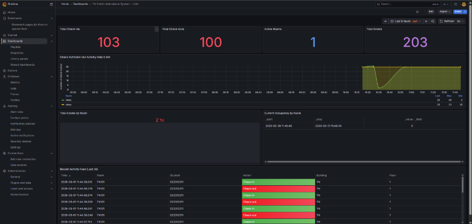
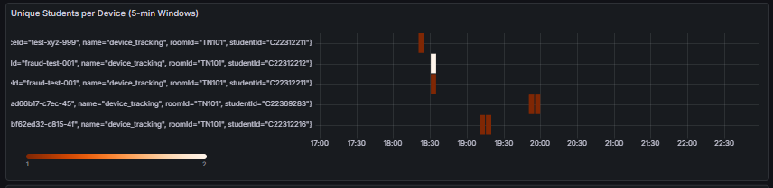
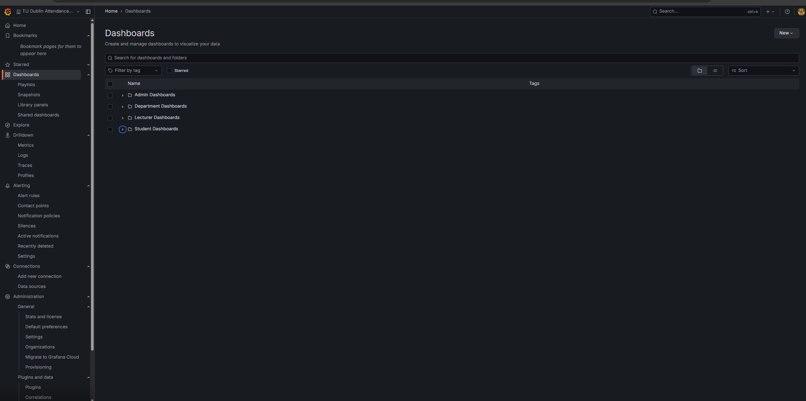
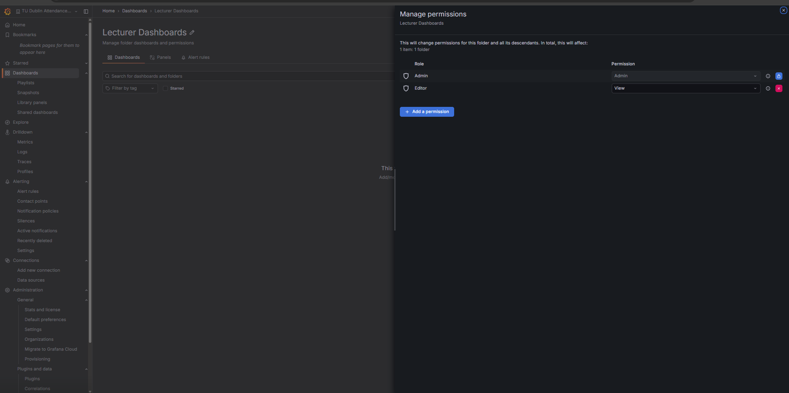
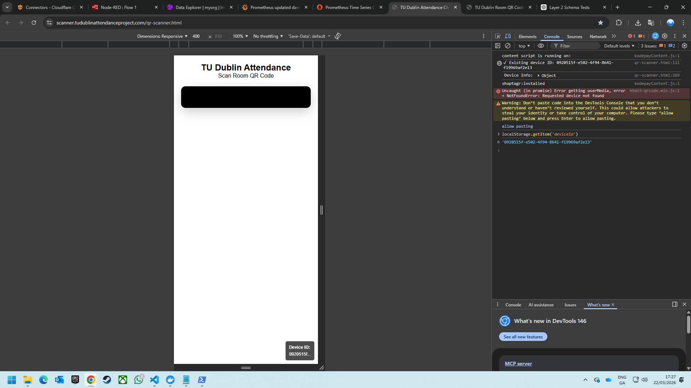
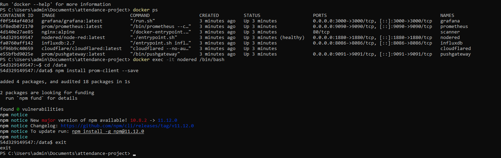

# Screenshots

Grafana dashboards and scanner UI from the running system.
← [Back to the main README](../README.md)

---

## Live attendance dashboard

The main operational view. Stat tiles for total check-ins, check-outs, active rooms and
total events; a check-in/check-out activity rate series; current occupancy by room; and a
live activity feed colour-coded green for check-in and red for check-out.

---

## Fraud detection — unique students per device

Device fingerprints on the Y axis, time on the X. Each row is a device ID; the panel
surfaces devices associated with more than one student ID inside a 5-minute window, which
is the signal for one phone checking in several people.

---

## RBAC dashboard folders

The four permission tiers as separate Grafana folders. Folder-level permissions control
what each role can navigate to; the `${__user.login}` filter inside each panel query is
what actually prevents cross-user data access.

---

## Folder permissions

Permissions on the Lecturer Dashboards folder — Admin retains full control, Editor is
granted View. Applied to the folder and all its descendants.

---

## Scanner and device fingerprinting

The mobile check-in interface with the QR reader active, and the generated device ID
persisted to `localStorage` — the identifier the fraud-detection panel above groups on.

---

## Prometheus client setup

Installing `prom-client` into the Node-RED container, alongside `docker ps` showing the
six running services.

