# Screenshots

The running system, following the path a check-in takes: room QR code → scanner → ingest
pipeline → storage → dashboards.
← [Back to the main README](../README.md)

---

## Dashboards

### Operations overview

The at-a-glance view for a building manager: check-ins today, active rooms, fraud flags,
per-room occupancy gauges against capacity, check-in share by building, and a seven-day
timeline with the live activity feed beneath it.

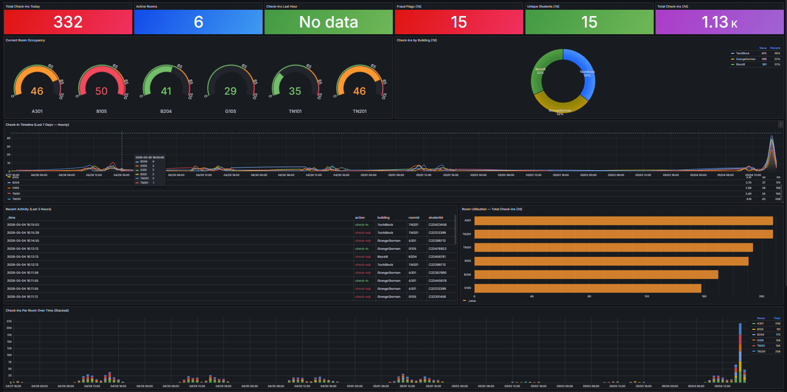

### Weekly overview and student engagement

Week-on-week comparison, 28-day volume, peak-hour analysis, and the student engagement
panels — most active students, unique students per day, and distribution of check-ins.

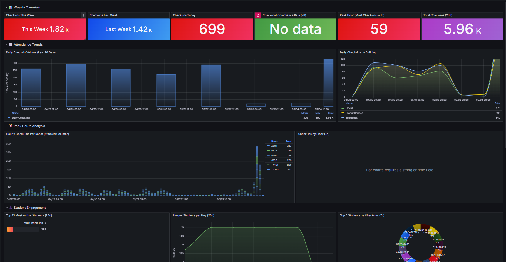

### Room analytics

Check-ins per room over time, check-ins versus check-outs, share of total by room, and the
room summary table ranked by volume.

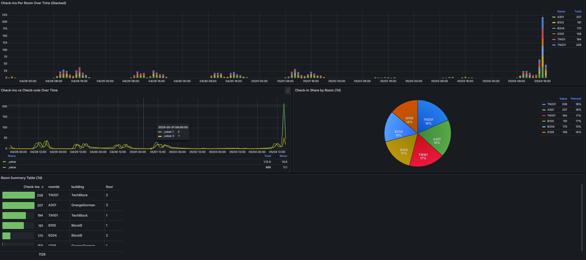

### Room and building intelligence

Occupancy trends in six-hour windows, building usage totals, and the security panels —
submission volume per student and a high-submission-count review queue.

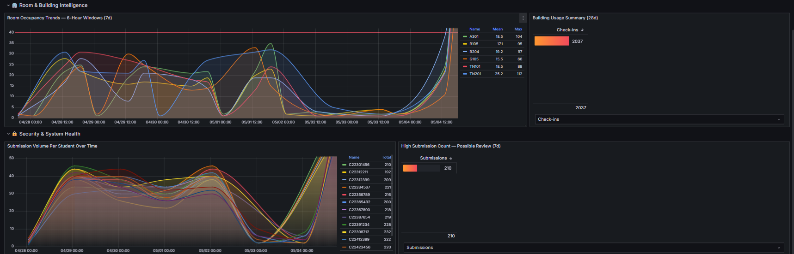

### Live attendance dashboard

The main operational view. Stat tiles for total check-ins, check-outs, active rooms and
total events; a check-in/check-out activity rate series; current occupancy by room; and a
live activity feed colour-coded green for check-in, red for check-out.

### Fraud detection — unique students per device

Device fingerprints on the Y axis, time on the X. Each row is a device ID; the panel
surfaces devices associated with more than one student ID inside a 5-minute window, which
is the signal for one phone checking in several people.

### RBAC dashboard folders

The four permission tiers as separate Grafana folders. Folder-level permissions control
what each role can navigate to; the `${__user.login}` filter inside each panel query is
what actually prevents cross-user data access.

### Folder permissions

Permissions on the Lecturer Dashboards folder — Admin retains full control, Editor is
granted View. Applied to the folder and all its descendants.

---

## Scanner and QR codes

### Printable room code

What actually goes on the door. The payload carries the room ID, from which the scanner
derives building and floor.

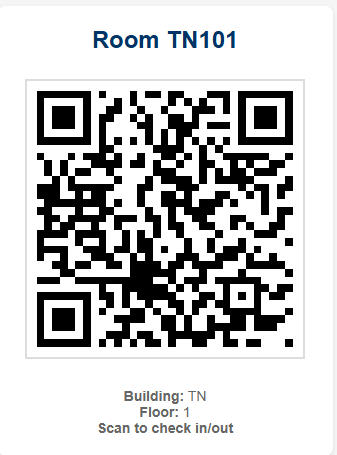

### QR code generator

Batch generation for a whole building — enter room numbers, generate, print.

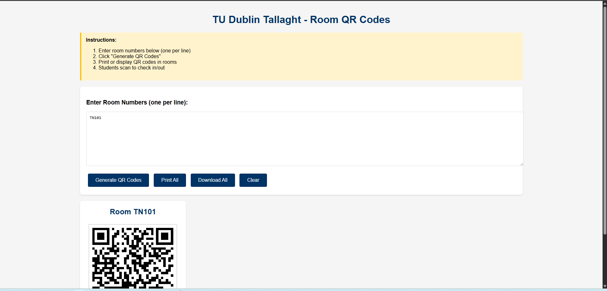

### Scanner and device fingerprinting

The mobile check-in interface with the QR reader active, and the generated device ID
persisted to `localStorage` — the identifier the fraud-detection panel groups on.

---

## Ingest pipeline

### Node-RED flow

The ingest path end to end: CORS preflight handling, `POST /attendance/submit`, the
validate-and-format stage, then the fan-out to InfluxDB and Prometheus with a `400` error
branch.

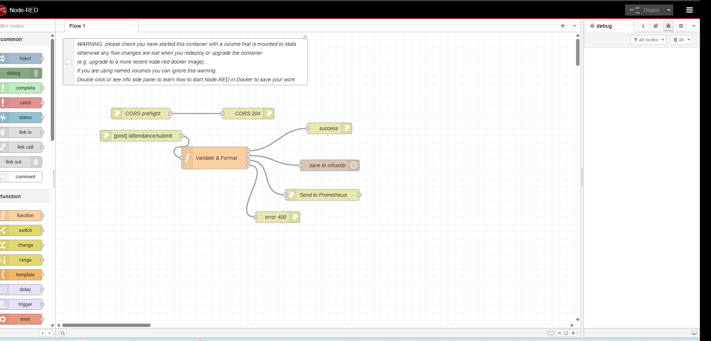

### Validation function

Inside the validate-and-format node — the layered input checks described in the main
README.

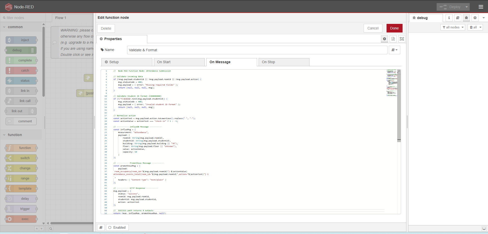

### API test

A check-in posted directly to the API, bypassing the browser: `200 OK` with
`{"status":"success"}` and the CORS headers applied by the same-origin proxy.

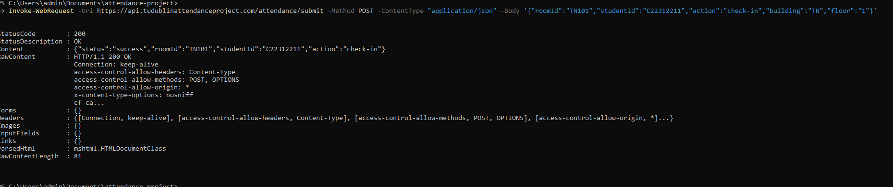

---

## Storage and metrics

### InfluxDB data explorer

Raw `attendance` measurement rows — building, room and timestamp per event.

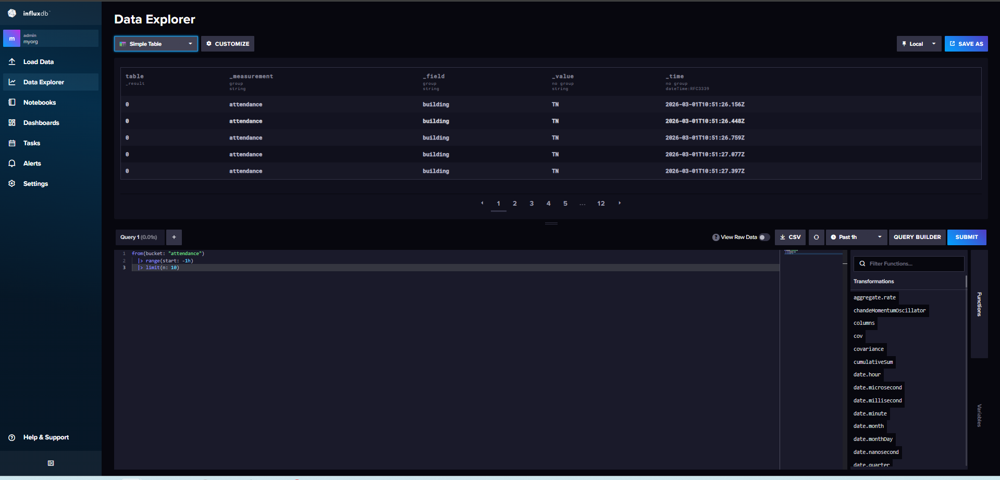

### Prometheus

Querying `attendance_events_total` by action and room.

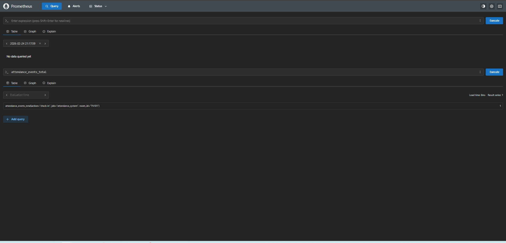

### Metrics exposition

`attendance_events_total` in Prometheus exposition format. This is the iteration-2 setup
served via Pushgateway on `:9091`, later replaced by a custom `/metrics` endpoint in
Node-RED once the counter-overwrite problem surfaced — see the main README.

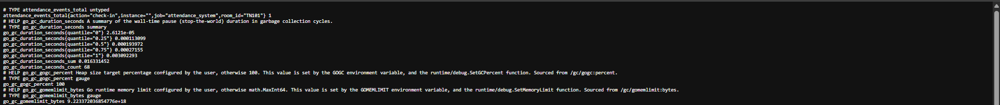

---

## Infrastructure

### The container stack

All services running under Docker Compose, with live nginx access logs from real scans.

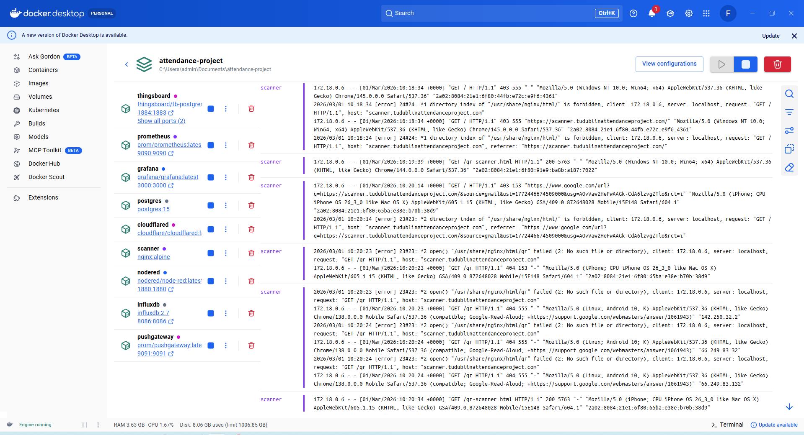

### Cloudflare Tunnel routes

Public hostnames mapped to internal services — `api.` and `scanner.` published through the
tunnel with no inbound ports open on the host.

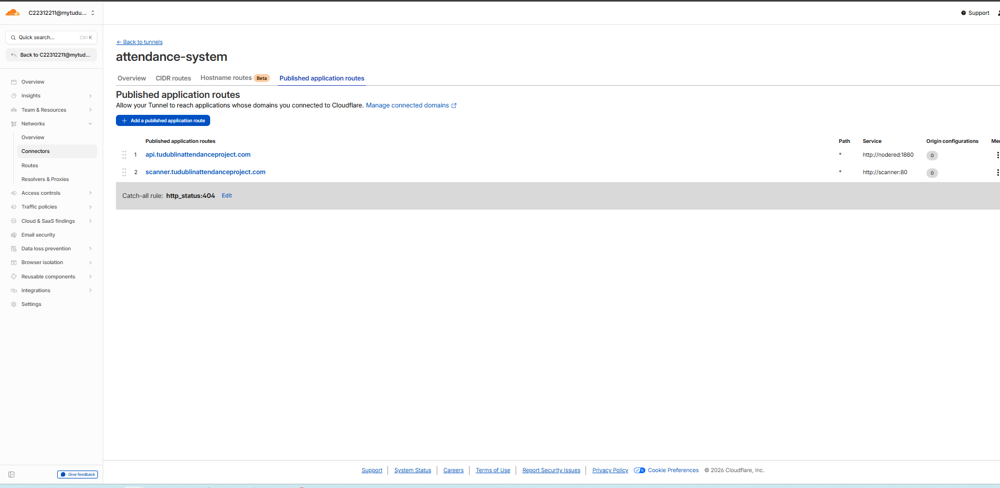

### Route configuration

The `api.` hostname routing to `nodered:1880` on the internal Docker network.

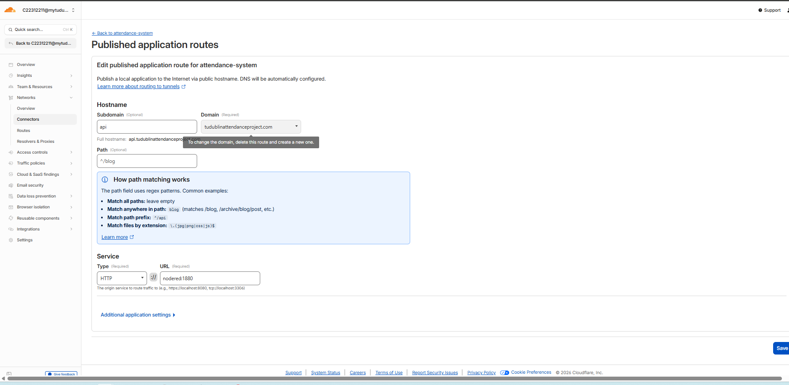
